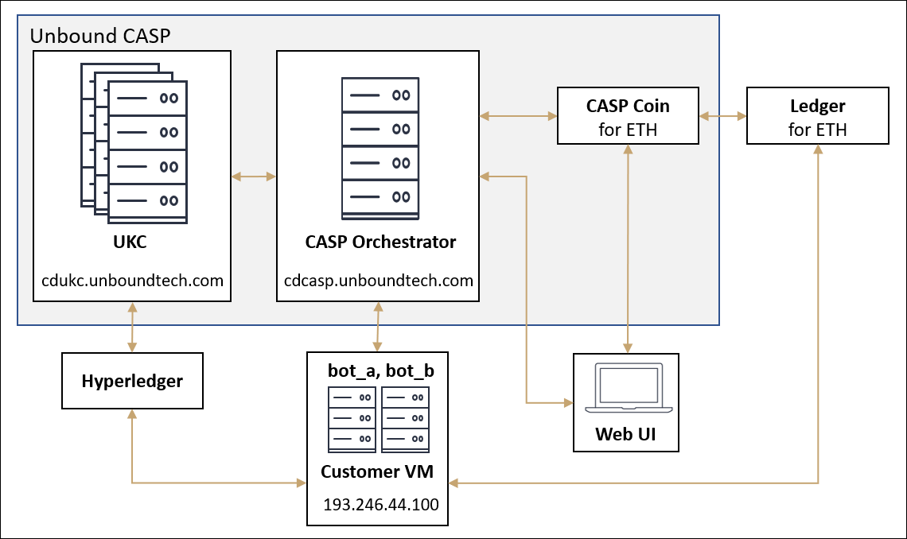

# ERC20 Contract Deployment with Unbound CASP
This demo application demonstrates how to use Unbound Crypto Assets Services Platform (CASP) for deploying, managing and executing transactions with a custom Ethereum ERC20 contract.

#	1. CASP Overview

Unbound Security's Crypto Asset Security Platform (“**CASP**”) is a pure-software solution that runs on any endpoint, server or cloud, at a security level above and beyond all existing solutions for blockchain custody and trading of crypto assets.

The CASP solution is built on the technological foundation of secure multiparty computation (MPC). As used in the CASP solution, it provides the following benefits:
-	A risk-based [Risk-Based Quorum Policy](https://www.unboundsecurity.com/docs/CASP/CASP_Developers_Guide-HTML/Content/Products/CASP/CASP_Offering_Description/Solution.htm#_Ref508800931) that provides a flexible mechanism to handle transaction signing by multiple participants across multiple groups.
-	Each private key exists as several separate random shares stored on separate locations and is refreshed constantly.
-	Key material never exists in the clear at any point of its lifecycle. Key shares are never combined at any point in time – not even when used or when created.
-	An attacker needs to get control over all involved servers and clients, simultaneously.
-	Real-time, tamper proof audit log that logs any key operation.

##	1.1. System Architecture
The basic system architecture is shown in the following figure.

 
The **CASP Orchestrator** is the heart of the CASP system. It communicates with all parts of the system, initiates creation of the key shares for the vault, manages the different distributed procedures, and acts as the external entry point for the relevant applications, such as the crypto asset applications.

The CASP Orchestrator is backed by the powerful key management capabilities of Unbound Key Control (UKC). UKC works together with the **Participants** to provide the complete approval signature for transactions, where Participants can be mobile devices, desktops, servers, or bots. CASP creates an ECDSA key, EdDSA key, or Schnorr key, which is used for all transactions, along with support for BIP derivations.

CASP’s open architecture enables communication with different types of crypto asset ledgers. For example, the ETH wallet enables communication with an Ethereum ledger. It prepares a transaction from the available ledger data and sends it to CASP. CASP then signs the transaction and returns it, which then transmits the signed transaction to the ledger. CASP seamlessly works with many different types of ledgers.

CASP provides the framework to create **Accounts**, which hold multiple **Vaults** where secrets are stored. Access control is managed by the **Quorum Policy** for all of the **Participants**. The CASP components are described in the following sections.

##	1.2. Accounts
An account is a container for a set of vaults and participants that manage these vaults. An account may represent a customer of the system, a trader, an organization, etc. The CASP service supports creating different accounts, managing account participants (human users or machine bot's), creating secure vaults for the account, and executing different crypto asset transactions within the account.

The CASP service supports the notion of global accounts, which can manage vaults across other accounts. This notion may support the use case of the CASP service providers managing vaults on behalf of the CASP customers.

##	1.3. Participants
A participant can be a human within the account or a bot taking part in crypto asset transactions. Each participant owns a share of the cryptographic material that is part of the different transactions. CASP supports participants using any relevant platform, including mobile devices, laptops, and different server platforms for bot's.

##	1.4. Vaults
A vault is a secure container for the cryptographic material used to protect a crypto asset, such as the seed or private key. CASP uses Multiparty Computation (MPC) to split the crypto material between the different participants in the vault, which ensures that the material never exists in a single place. In addition, only the approved set of participants can complete a transaction based on the vault definition.

A Quorum vault shares the responsibility of executing a transaction between many different participants in a structure defined by the vault policy. The vault policy contains a quorum-based structure where there are any number of groups, any threshold value per group, any tree structure between different groups, etc. The MPC protocols used by CASP ensure that if and only if the quorum definition is satisfied, a transaction can take place, which is enforced on the cryptographic level.

##	1.5. Risk-Based Quorum Policy
Each CASP vault has a set of risk-based quorum policies associated with it, which are defined during vault creation. These policies assign a different quorum policy to different transactions, based on the transaction details (such as the transaction amount or the time of day).

Approvals are defined by a group of authorizing entities, of which a minimal-size subset (called a quorum) is required to approve the transaction. M approvals from a set of N entities is known as "MofN". For example, the client may define 8 entities, of which 4 must approve the transaction. Another example is where there must be 3 approvals from group A and 2 approvals from group B.

The number of groups, size of groups, and the size of the approving subset is fully flexible and can be different for each vault.

# 2. Prerequisites
Before running the demo, you need to have an Ethereum Ropsten Test wallet with ~1 Eth. During the demo, we will transfer some to the *Contract vault*.

Deploying the contract is done by sending a transaction to the Ethereum network, which requires a miner fee in Eth just like any other transaction.

One simple way to create an Ethereum Test wallet is to use [MetaMask](https://metamask.io/) inside of your Google Chrome browser.

## 2.1. Monitor Logfiles
Before beginning the demo, you may want to monitor the CASP and/or UKC logfiles. Monitoring them allows us to learn about the cryptographic operations that are forwarded to the remote UKC server by CASP and more details about the CASP operations.

### 2.1.1. CASP Logfile
To monitor the CASP logfile, run this command in a new terminal window:
    ```
    ssh root@193.246.44.100 -p 22022 "/root/unbound/scripts/monitor_casp_log.sh"
    ```
Use the password: !5eLfdwk

### 2.1.2. UKC Logfile
To monitor the UKC logfiles on the remote UKC EP (Entry point) server, run this command in a new terminal window:
    ```
    ssh root@193.246.44.100 -p 22022 "/root/unbound/scripts/monitor_ukc_log.sh"
    ```
Use the password: !5eLfdwk

## 2.2. Debug
The CASP commands can be run in a debug mode that shows all the relevant curl commands for each of the operations.

To enable debug mode, run the CASP commands as follows:
```
 DEBUG=super-* ./casp <COMMAND>
```
**Note**: It is recommended to **only** run the demo with debug mode if you specifically need to see the curl commands.

# 3. Running the Demo
Use the following steps to run the CASP demo.

1. **VM terminal** - Log into the VM terminal. 
   ```
   ssh root@193.246.44.100 -p 22022
   ```
   Use the password:  !5eLfdwk
2. **Working directory** - access the folder with the CASP files.
   ```
   cd /root/unbound/erc20/CASP-ERC20-JS-DEMO/
   ```
   Note that these files were downloaded from the [GitHub repository](https://github.com/unboundsecurity/unbound-sample-code/tree/main/blockchain/ethereum/erc20).
3. **Reset** - This step cleans up any data from previously running the demo.
   ```
    ./casp reset
    ```
4. **Show config** - the configuration file contains all the setup information needed for CASP. It defines the acount name, vault names, the Infura token, the Ethereum gas price, and more. Modify these values as needed.

    ```
    cat ./config.json
    ```
    If you find that transactions are too slow, you can change the Ethereum gas price.
3. **Run the demo** - Follow the onscreen instructions. The demo uses a contract, defined in *./contracts/UnboundToken.sol*, which is compiled in this step.
    ```
    ./casp start
    ```
    Before deploying the contract, we need an Ethereum address and a private key. To accomplish this step, first we set up a CASP vault where the key will be stored.
    
   The vault is created with two participants, named **bot_a** and **bot_b**. These two participants are needed to approve operations on the vault.

4. **Start the bot participants** - Before the vault can be used, the two participants need to accept joining the vault. After both accept, the vault is created. Subsequent operations require 1 out of 2 of the participants to approve the operation, as defined in the vault policy.
   - Start **bot_a** in a new terminal.
        ```
        ssh root@193.246.44.100 -p 22022 -t "cd /root/unbound/bots/bot_a; ./start_bot.sh -m"
        ```
        - Use the password:  !5eLfdwk
        - You see that the bot starts and shows that there is 1 pending operation to join the vault. You can decline joining the vault, approve joining the vault, or set the bot to always approve. Select 2 to approve joining the vault.
   - Start **bot_b** in a new terminal.
        ```
        ssh root@193.246.44.100 -p 22022 -t "cd /root/unbound/bots/bot_b; ./start_bot.sh -m"
        ```
        - Use the password:  !5eLfdwk
5. **Show info** - you can run this command at any time to show the status of the vaults in your account.
    ```
    ./casp info
    ```
6. **Withdraw** - you can run this command at any time to send assets from a vault to an address.
   ```
    ./casp withdraw
    ```
    Note that in the bot participant, you see the parsed transaction, such as:
    ```
    parsed ETH:
    contract address: CE152698949F45976A3F28AD696E3E1B43CA954E
    reciepient address: FE32A76A5D40BEA31749439C2B39EFC0AC3346AC
    gas limit: 51498
    value: 4000000
   ```
   
	
# 4. Other Information

## 4.1. CASP Backups
CASP key material is shared across the UKC and the participants, and CASP management data is stored in the CASP DB. Backup of this data is divided into steps that are done during setup and steps needed on an ongoing basis. The backup data can be used to recover from a variety of different scenarios.

You can find the cold backup private key on the VM:
```
/root/unbound/casp_backup.pem
```

See [Key Backup and Restore](https://www.unboundsecurity.com/docs/CASP/Versions/1.0.1905/CASP_User_Guide-HTML/Content/Products/CASP/CASP_User_Guide/Key_Backup_and_Restore.htm) for more information.

## 4.2. CASP Documentation
CASP has these associated documents:

- [CASP Release Notes](https://www.unboundsecurity.com/docs/CASP/Versions/1.0.1905/CASP_Release_Notes-HTML/Content/Products/Unbound_Cover_Page.htm)
- [CASP Frequently Asked Questions](https://www.unboundsecurity.com/docs/CASP/Versions/1.0.1905/CASP_FAQ-HTML/Content/Products/Unbound_Cover_Page.htm)
- [CASP Developers Guide with API Reference](https://www.unboundsecurity.com/docs/CASP/Versions/1.0.1905/CASP_Developers_Guide-HTML/Content/Products/Unbound_Cover_Page.htm)
- [CASP User Guide](https://www.unboundsecurity.com/docs/CASP/Versions/1.0.1905/CASP_User_Guide-HTML/Content/Products/Unbound_Cover_Page.htm)
- [CASP Participant SDK](https://www.unboundsecurity.com/docs/CASP/Versions/1.0.1905/CASP_Participant_SDK-HTML/Content/Products/Unbound_Cover_Page.htm)

## 4.3. APIs for Common Functions
The following list provides links to CASP APIs that provide common wallet functions.
- Wallet creation - [Create new vault](https://www.unboundsecurity.com/docs/CASP/API/casp-1.0.1905-byow.html#create-new-vault)
    - Generate address - [Create a new address](https://www.unboundsecurity.com/docs/CASP/API/casp-1.0.1905-byow.html#create-a-new-address)
 	- Retrieve public key - [Get vault public key](https://www.unboundsecurity.com/docs/CASP/API/casp-1.0.1905-byow.html#get-vault-public-key)
- Get value of funds of an address/account - [Get BIP44 account balance](https://www.unboundsecurity.com/docs/CASP/API/casp-1.0.1905-coin.html#get-bip44-account-balance)
- Transaction signing - Start a signing process
    - Send/Receive/Mint funds to an address/account - [Start withdrawal process](https://www.unboundsecurity.com/docs/CASP/API/casp-1.0.1905-coin.html#start-withdrawal-process)

A full API reference is found in the [CASP Developers Guide](https://www.unboundsecurity.com/docs/CASP/Versions/1.0.1905/CASP_Developers_Guide-HTML/Content/Products/Unbound_Cover_Page.htm).

# 5. Next Steps
The following steps may be useful in further utilizing CASP capabilities.

## 5.1. Approval Quorum Groups
You can change the approval quorum groups that are used to approve operations. To enable more complex groups, Unbound provided 5 bots in the customer VM. The bots are named **bot_a** through **bot_e**.

To modify the groups:
1. Edit `/root/unbound/erc20/CASP-ERC20-JS-DEMO/config.json`.
1. Locate the relevant vault in the *config.json* file.
1. Each vault has a group definition, such as:
    ```
	"groups": {
        "A": {
          "requiredApprovals": 1,
          "members": [
            "bot_a",
            "bot_b"
          ]
        }
      }
    ```
1. Modify the group definition as needed. 
    - The parameter *requiredApprovals* determines how many participants are **required** for approval. 
	- The parameter *members* determines which participants are part of the group.
	- You can add mulitiple groups using the format in the file (In this version it is  limited to 2 groups).
1. Save the file.
1. Reset the demo and then start it by running:
   ```
    ./casp reset
	./casp start
   ```
The relevant bots will receive join requests for vaults that they are part of.

For example, to create 2 groups, where one group has 1 out of 2 required and the other group has 2 out of 3 required, you can use this definition:
   ```
    "groups": {
        "A": {
          "requiredApprovals": 1,
          "members": [
            "bot_a",
            "bot_b"
          ]
        }
		"B": {
          "requiredApprovals": 2,
          "members": [
            "bot_c",
            "bot_d",
            "bot_e"
          ]
        }
      }
   ```


## 5.2. Mobile App
You can use the CASP mobile app to approve transactions. First, in the [Web UI](file:///C:/FlareOut/Output/CASP/CASP_User_Guide-HTML/Content/Products/CASP/CASP_User_Guide/Web_Interface.htm) create a [new participant](file:///C:/FlareOut/Output/CASP/CASP_User_Guide-HTML/Content/Products/CASP/CASP_User_Guide/Web_Interface.htm#Participants) and activate it on the mobile app. Next, add the participant to the vault approval group using the procedure described in the previous section.

See [CASP Mobile App](https://www.unboundsecurity.com/docs/CASP/CASP_User_Guide-HTML/Content/Products/CASP/CASP_User_Guide/Mobile_App.htm) for more information.
